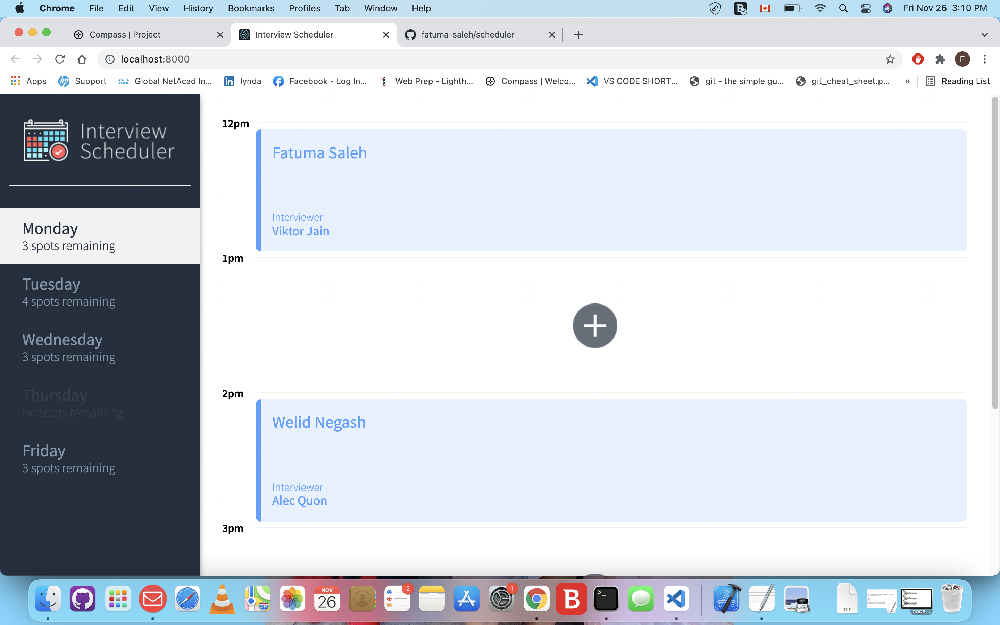
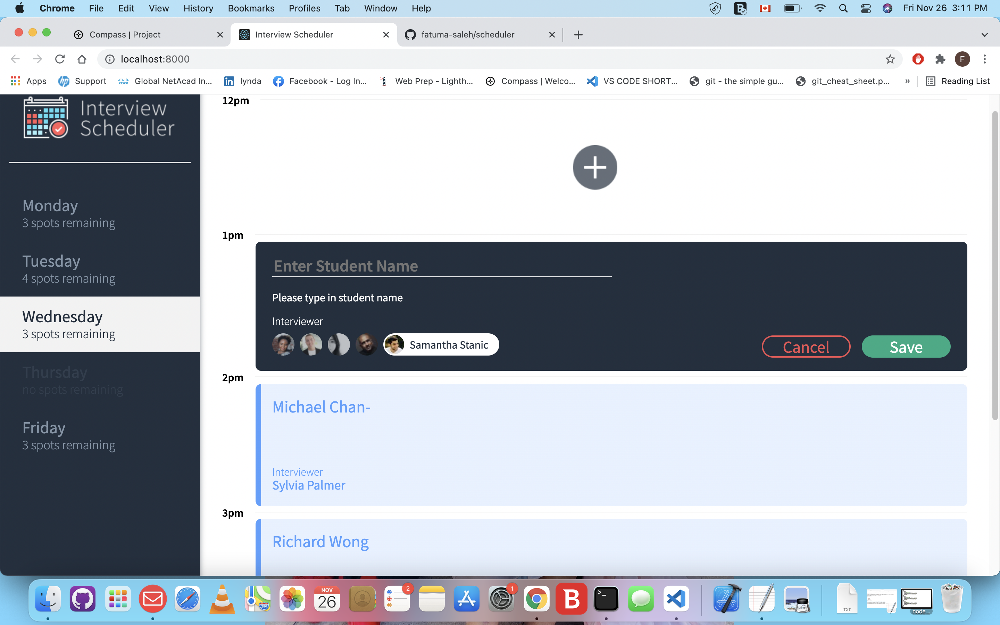

# Scheduler

Scheduler is a single-page application (SPA) that allows users to book technical interviews between students and mentors. Appointments can be between the hours of 12 PM and 5 PM, Monday to Friday. Each appointment has one student and one interviewer. When creating a new appointment, the user can enter any student name while the interviewer is chosen from a predefined list. The user can save the appointment and view the entire schedule of appointments on any day of the week. Appointments can also be edited or deleted. The front end of this project is built with React and makes requests to an API to fetch and store appointment data from a database.
## Setup

 - Install all the dependencies in package.json file with `npm install`.
 - This project uses an API server (scheduler-api) to handle the API requests
 - The client(scheduler) runs on port 8000, and the API server runs on port 8001.
## Running Webpack Development Server for the scheduler 

- run `npm start` 
## Running Jest Test Framework

- run `npm test` 
## Running Storybook Visual Testbed

run `npm run storybook`

## Final Product

